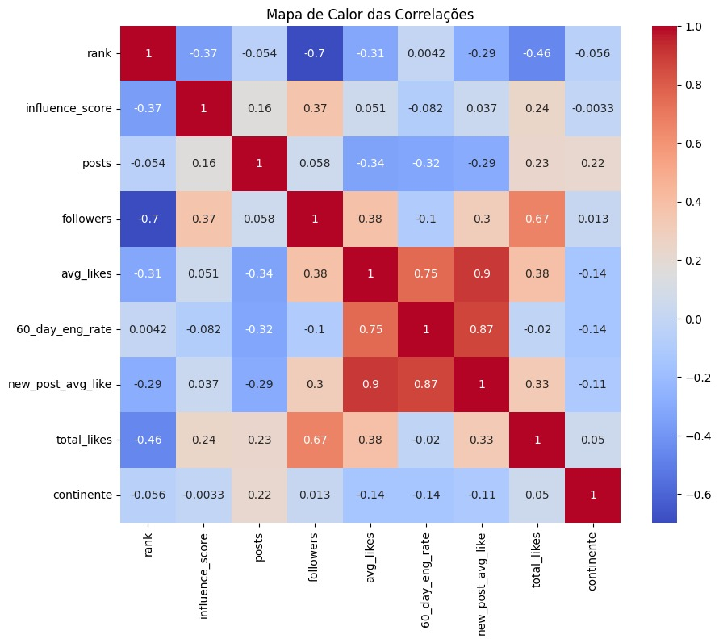
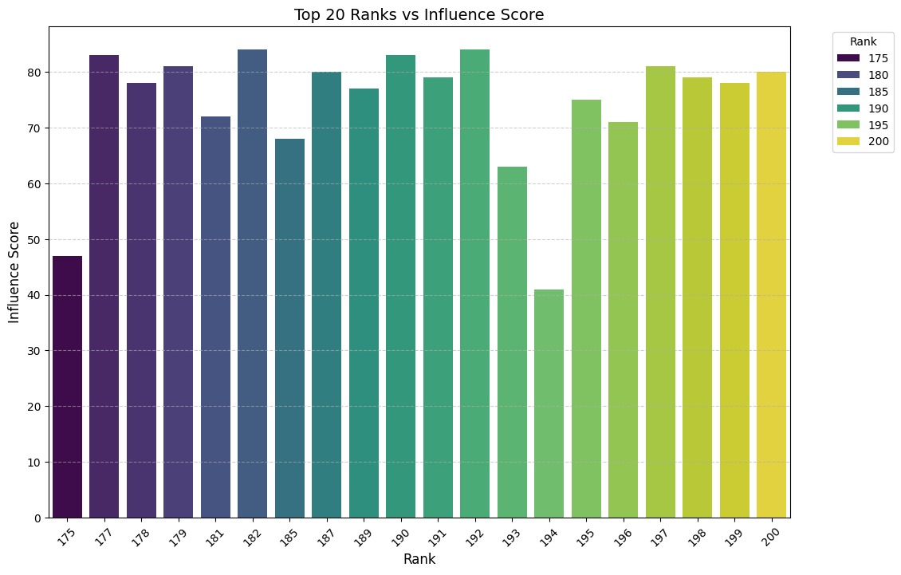
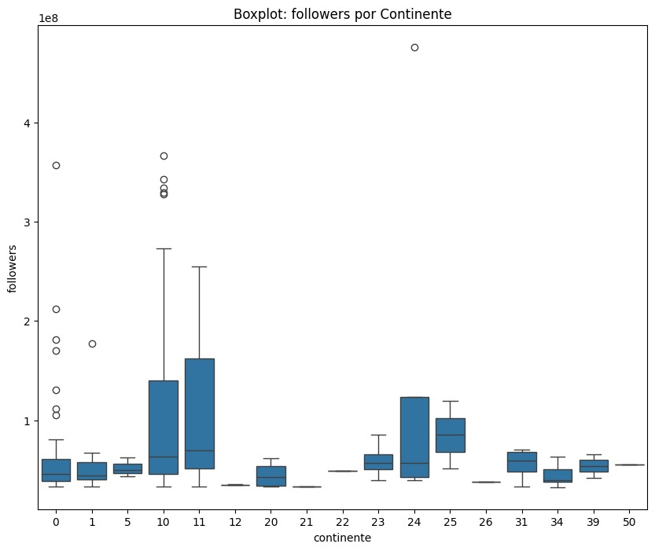

# Implementação e Análise do Algoritmo KNN

## Descrição do Projeto:
  Este projeto utiliza um algoritmo de inteligência artificial (k-Nearest Neighbors) para prever o impacto dos influenciadores do Instagram, com base em informações como número de seguidores, curtidas nas postagens e taxa de engajamento. O objetivo é ajudar marcas a identificar influenciadores que podem ter maior sucesso em suas campanhas de marketing, tornando a escolha mais fácil e eficiente. O modelo analisa dados dos influenciadores e faz previsões sobre seu "poder de influência" na plataforma.

---

# Instalação:

Siga os passos abaixo para configurar o ambiente e rodar o projeto localmente:

1. **Clone o repositório**  
   Use o comando `git clone` para clonar o repositório no seu computador.

2. **Acesse a pasta do projeto**  
   Entre no diretório onde o repositório foi clonado.

3. **Crie um ambiente virtual** 
   Crie e ative um ambiente virtual para isolar as dependências do projeto.

4. **Instale as dependências**  
   Com o ambiente virtual ativado, instale as bibliotecas necessárias com o comando `pip install -r requirements.txt`.

---

# Como Executar:

Siga as etapas abaixo para rodar o código do projeto após configurar o ambiente:

1. **Abra o terminal ou prompt de comando**  
   Navegue até o diretório do projeto, onde você clonou o repositório.

2. **Ative o ambiente virtual** (caso tenha criado um ambiente virtual)
   - **No Windows**: Execute `.\venv\Scripts\activate`
   - **No macOS/Linux**: Execute `source venv/bin/activate`

3. **Execute o script principal**  
   No terminal, execute o script Python que contém a implementação principal do projeto. O comando pode ser:
   python AtividadeKnn.ipynb

4. **Acompanhe o processo**  
   O script irá processar os dados e gerar as previsões com o modelo kNN. Você verá as saídas diretamente no terminal ou serão gerados arquivos de resultados, dependendo de como o script foi configurado.

5. **Verifique os resultados**  
   Após a execução, o código pode gerar gráficos e outros resultados, como arquivos de log ou relatórios, para que você possa visualizar o desempenho do modelo.

---

# Tecnologias Utilizadas

Este projeto foi desenvolvido utilizando as seguintes tecnologias e bibliotecas:

- **Python**: Linguagem de programação principal utilizada para a implementação do modelo e manipulação dos dados.
- **Pandas**: Biblioteca para manipulação e análise de dados, usada para carregar, limpar e transformar o conjunto de dados.
- **NumPy**: Biblioteca usada para realizar operações matemáticas e manipulação de arrays, essencial para o processamento numérico dos dados.
- **Scikit-learn**: Framework para aprendizado de máquina, utilizado para implementar o algoritmo k-Nearest Neighbors (kNN) e realizar a otimização de hiperparâmetros com GridSearchCV.
- **Matplotlib** e **Seaborn**: Bibliotecas para criação de gráficos e visualizações, utilizadas para explorar os dados e analisar o desempenho do modelo.

---

# Resultados
   **Figura 1:** Este mapa de calor visualiza as correlações entre diferentes métricas, como número de seguidores, engajamento e outras variáveis relevantes. As cores mais quentes (vermelho) indicam uma correlação positiva forte, enquanto as cores mais frias (azul) indicam uma correlação negativa forte. Cores próximas ao branco indicam correlações fracas ou inexistentes.
  

   **Figura 2:** O gráfico visualiza a correlação entre a classificação e a pontuação de influência dos 20 primeiros elementos. A pontuação de influência, que mede a relevância ou impacto de cada elemento, não apresenta uma relação linear com a classificação. Isso sugere que outros fatores, além da posição no ranking, contribuem para a pontuação final. 
  

   **Figura 3:** O boxplot compara a distribuição do número de seguidores por continente, evidenciando diferenças significativas entre as regiões.

---

# Autores e Colaboradores:

1. Gabriel Marçal
2. Leon Santana
